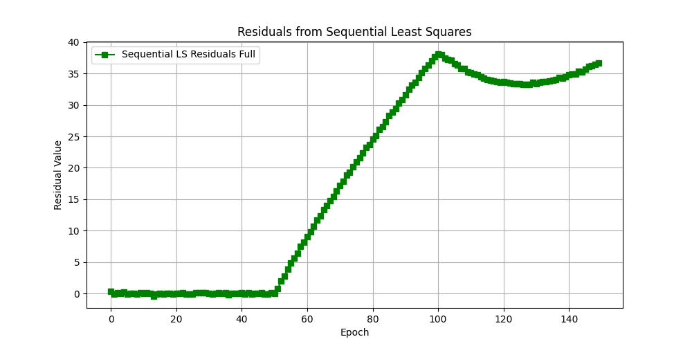

# Wireless Location Estimation with Least Squares and Kalman Filter

## Description
This repository contains the implementation of various estimation techniques used for 2D position estimation based on range measurements to several fixed reference points. The lab explores the use of **Parametric Least Squares**, **Summation-of-Normals**, **Sequential Least Squares**, and **Kalman Filters** in estimating the position of a user in a wireless location system.

The lab uses **Time of Arrival (TOA)** range measurements to fixed targets for both stationary and moving user cases. The first 50 epochs represent stationary data, and after that, the user begins to move. Kalman filtering is applied to dynamically handle the moving user data, while the sequential least squares method is used for comparison.

## Lab Objectives
- Review non-linear least-squares estimation techniques.
- Implement sequential least-squares and a basic Kalman filter.
- Understand the challenges of land-based wireless location using range measurements.
- Use Kalman filtering to handle dynamic data where sequential least squares may fail to provide accurate results.

## Installation & Requirements
1. Clone this repository:
    ```bash
    git clone https://github.com/talhaitis/wireless-location-estimation
    ```

2. Install dependencies:
    ```bash
    pip install numpy matplotlib
    ```

3. Place the `Lab1data.txt` file in the same directory as the script.

## How to Run
1. Run the main script:
    ```bash
    python lab1-refined.py
    ```

## Results

### 1. **Estimated Position Using Kalman Filter**
This graph shows the estimated position of the user using the Kalman filter, incorporating a velocity model to track the position over time, particularly helpful during the dynamic motion phase.


### 2. **X and Y Coordinates Over Time from Parametric Least Squares**
This plot shows the position estimation over time using **parametric least squares**. The user starts stationary and then moves after the 50th epoch, highlighting how the parametric method struggles with dynamic data after the user starts moving.


### 3. **Effect of Process Noise Q on Kalman Filter Solution**
The effect of varying the process noise (Q) on the Kalman filter is demonstrated. The plot illustrates the position estimates under different levels of noise (Q = 0, 0.1, and 10). This experiment helps to see how noise affects the filter’s performance.


### 4. **Residuals from Batch Least Squares (BLS)**
This graph shows the residuals of range measurements after applying **Batch Least Squares** to the stationary data. The residuals are fairly consistent, with small errors as expected.


### 5. **Residuals from Summation of Normal Least Squares (SONs)**
The residuals from **Summation of Normal Least Squares** show how this method compares to batch least squares in terms of residuals. Similar to BLS, the results are relatively stable but can still show some variation.


### 6. **Residuals from Sequential Least Squares (SLs)**
This plot shows how **Sequential Least Squares** performs with dynamic data. The residuals increase after the 50th epoch, when the user begins moving, indicating that this method is not as effective in tracking the user’s movement.



### 7. **Estimated Velocity Components Over Time**
This graph shows the estimated **velocity components** (in the X and Y directions) using the Kalman filter with a velocity model. The velocity estimates help demonstrate the dynamic tracking capabilities of the Kalman filter compared to static methods.


## License
This project is licensed under the MIT License - see the [LICENSE](LICENSE) file for details.
